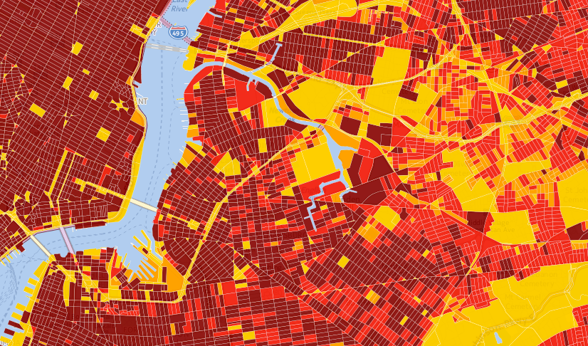

#Globalsat DG-100 GPS+ Data Logger - GPS Project
[BETA TEST MAP](https://www.mapbox.com/v3/dms2203.ig16d6on/page.html#14/40.7189/-73.9933)

#####Purpose
To examine the reliability of GPS data logging for capturing trips in New York City. 

######BEST/CSIBS Staff
Ciara Boyd - cboyd7473@mytu.tuskegee.edu

Joseph Konecko - joseph.konecko@stonybrook.edu

[BEST/CSIBS Staff Schedule](https://github.com/nygeog/globalsat/raw/master/docs/2014_BEST_CSIBS%20calendar.pdf)

##Tasks for best/csibs staff:
<!--0. ~~Test~~ -->
1. ~~Download the drivers and software (Windows version). [Software and Drivers](https://github.com/nygeog/globalsat#software-and-drivers-download)~~
2. ~~Install the driver. (Windows XP/ Vista/ 7 USB Drivers)~~
3. ~~Install the software. (Data Utility)~~
4. Send me GPX files from device.
5. Go on Toph's walks. 

##Tasks for Danny:
1. ~~Send Toph's GPS walk maps.~~
2. ~~Send Toph's Protocol.~~
3. Create walks for Tree Canopy and Buildings for post-Toph walks walks. 

#GPS Walks
##Toph's Walks
Here is a link to a [CartoDB map of the walks](http://cdb.io/1o5lbgn). Click [here for the methods of creating the walks.](https://github.com/nygeog/globalsat#building-bulk-density-and-choosing-walks)

##Danny's McCarren Park Walk
Click image to get to seperate page documenting the walks. 

#Protocol
####GPS Start 

1. Cold start the GPS at beginning of walk?

###DG-100 GPS+ Specifications
Link to [Spec sheet pdf](https://github.com/nygeog/globalsat/blob/master/docs/dg100_spec.pdf?raw=true)

###DG-100 GPS+ Video 
This video provides an overview of the device. 
[GlobalSat DG-100 Video](https://www.youtube.com/watch?v=-ZuWIWfxt4U) 

###DG-100 Software and Drivers (download)
[GPS software and drivers - GlobalSat website](http://www.usglobalsat.com/s-85-dg-100-support.aspx) 

* Download the Windows version

The windows software allows for more export options (according to the GlobalSat tech I spoke to on the phone) and I've used. I haven't tried the mac version yet. 

I have a video that shows the steps on how to use the software but at this point I don't think I can show or share the file b/c it includes the raw data from the DOHMH PATS. 

###GlobalSat Data Logger PC Utility (Windows) 
[BEH GlobalSat Data Logger PC Utility (Windows) Youtube Video Link](https://www.youtube.com/watch?v=nXzMpCh_Nww) 

###GlobalSync for Mac
[BEH GlobalSync for Mac Youtube Video Link](https://www.youtube.com/watch?v=PBN1F8u4G88&feature=youtu.be) 

<!--<iframe width="420" height="315" src="http://www.youtube.com/embed/PBN1F8u4G88" frameborder="0" allowfullscreen></iframe>-->
###DG-100 User Guide (pdf)
[User guide pdf](https://github.com/nygeog/globalsat/blob/master/docs/dg100_userguide.pdf?raw=true)

##Toph's Poster
This poster includes info from Toph (former grad student of Andrew Rundle) who did these walks and presented a poster on the results. 
[Toph's Poster as PDF](https://github.com/nygeog/globalsat/raw/master/docs/past_work/Practicum%20Poster%20Board.pdf)

#Quartiles of Percent Tree Canopy and Building Bulk by Census Block (2010)
Click map to bring you to CartoDB
####Building Density

####Percent Tree Canopy

####Buildings and Trees High and Low Quartiles

[ALL THREE LAYERS](http://cdb.io/1l1ALKi)

##Turning off WAAS
To turn off the Wide Area Augmentation System Settings go to;
Settings -> Configuration 

Deselect the checkbox for WAAS for 1 of the devices for the 2 that you have.  Make sure you note which device ID has WAAS on and which has WAAS off. 

I don't have a device currently with me but here's a short [video for turning off WAAS](http://youtu.be/UgUVzm4E5UY) that might help if you are stumped.

####Notes

Modes A,B,C can have different time periods set. All are at 5 seconds right now.

#####Devices/Software

1. GlobalSat Data Logger
2. RunKeeper? App

#####Building Bulk Density and Choosing Walks

The purpose of this exercise was to identify street segments (city blocks) that we assumed would exhibit either high (of the upper quartile) GPS tracking error (via multipath or blocked line-of-sight interference) or low (of the lower quartile) GPS tracking error and then field test these street segments by walking down them with GPS devices, and comparing the travel distance observed by the GPS (point observation to point obervation distance calculations without correction) to the length of the segment walk. 

Using New York City Department of Information Technology & Telecommunications (NYC DOITT) Elevation Data and spatially joining (via Intersect function) Building Footprints, Roadbeds, Transportation Structures and US Census Blocks (2000) as a continuous but subdivided vector surface I was able to assign the 2D layers the Z value of the Elevation Data. The overlay rule of the data was that the elevation value would be assigned, if coincidental with the feature layer, to first the building footprint layer, then the transportation structure layer (for example, used to prevent non-building areas from being assigned bridge elevation Z-values), then the roadbed, and then the Census blocks. 

I calculate the geometric area of the building and then with the joined elevation variable (and then subtracted elevation of block area giving the 'height' of the building), multiplied Area by Height to get the Volume (or building "Envelope" or "Bulk"). Then summed the volume of all the buildings on their respective blocks and then divided by the total block area (as all blockes are not the same area). The values were then classified into quantiles. 

Then using a map of the quantiles of blocks by building bulk density I visually identified 1200 ft (check this against your maps!) walks that were either in the upper or lower quartile of building bulk density. These walks were also selected in that they were within a reasonable distance of public transit from Columbia University.

###Assisted GPS

######How Cell Phone GPS Works
[How the iPhone knows where you are - MacWorld](http://www.macworld.com/article/1159528/how_iphone_location_works.html)

<!--[Assisted-GPS Video](https://www.youtube.com/watch?v=Ph9tLBFzxy8)

[What do GPS and AGPS mean](https://www.youtube.com/watch?v=QYT9-qP_-pk&list=PLzdwB8GpDDG_6dIjq0ly8q89BjfcF1DI8)
[Google Hangout AGPS](https://www.youtube.com/watch?v=x4_22zIMmHU)-->

#Public Health Paper Resources
###From Gina
1.             Almanza E, Jerrett M, Dunton G, Seto E, Pentz MA. A study of community design, greenness, and physical activity in children using satellite, GPS and accelerometer data. Health Place 2012;18(1):46-54.
2.             Duncan MJ, Badland HM, Mummery WK. Applying GPS to enhance understanding of transport-related physical activity. J Sci Med Sport 2009;12(5):549-56.
3.             Dunton, Genevieve Fridlund, et al. "Locations of joint physical activity in parent–child pairs based on accelerometer and GPS monitoring." Annals of Behavioral Medicine 45.1 (2013): 162-172.
4.             Evenson, Kelly R., et al. "Assessing the Contribution of Parks to Physical Activity using GPS and Accelerometry." Medicine and science in sports and exercise (2013).

###From Toph's Poster

1. Stopher P, FitzGerald C, Zhang J. Search for a global positioning system device to measure
person travel. Transportation Research Part C: Emerging Technologies.
2008;16(3):350–369.
2. Cooper AR, Page AS, Wheeler BW, et al. Mapping the Walk to School Using Accelerometry
Combined with a Global Positioning System. AMEPRE. 2010;38(2):178–183.
3. Duncan MJ, Badland HM, MUMMERY WK. Applying GPS to enhance understanding of
transport-related physical activity. J Sci Med Sport. 2009;12(5):549–556.
4. Duncan MJ, Mummery KW, Ben J Dascombe. Utility of global positioning system to
measure active transport in urban areas. Med Sci Sports Exerc. 2007;39(10):
1851–1857.
5. Michael Y, McGregor E, Allen J, Fickas S. Observing outdoor activity using Global
Positioning System-enabled cell phones. Smart Homes and Health Telematics.
2008:177–184.
6. Wiehe SE, Carroll AE, Liu GC, et al. Using GPS-enabled cell phones to track the travel
patterns of adolescents. Int J Health Geogr. 2008;7(1):22.