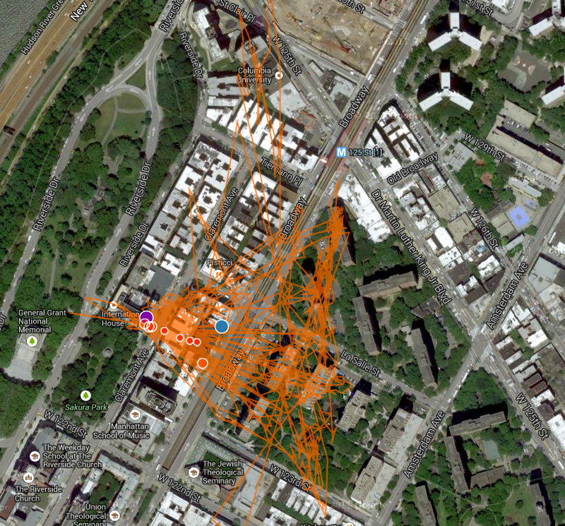

#GPS Stationary Battery Test

###Time of Battery life
#####Start
2014-06-10T01:15:53
#####End
2014-06-12T15:53:49

#####Hours by Day

Day 1 - July 10 - 22.26 hours

Day 2 - July 11 - 24    hours

Day 3 - July 12 - 15.88 hours
###Distance
31.87 Kilometers (Distance of Tracks line feature - orange on CartoDB map)

###Map
Click Map Image to bring you to the CartoDB animation

