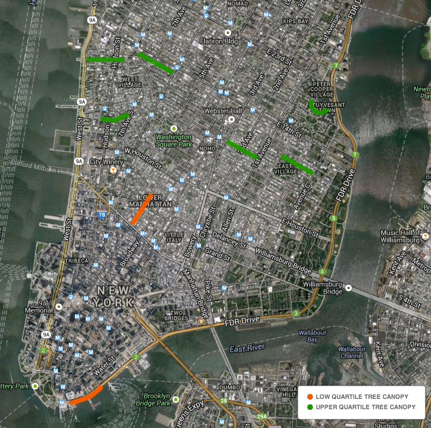

#Tree Canopy GPS Walks in Manhattan & Bronx

###Map
Click Map Image to view the CartoDB Map

Click <strong>View as an iFrame</strong> if you need more screen real estate on your phone. 

##Walks
The map should be clear (if zoomed in) which side of the street to walk down. 

###Direction 
If the walk is primarily North/South oriented walk from North to South. If the walk is East/West oriented walk from West to East. 

If for any chance a side of the street is impassable upon first getting to the walk, use the other side but mark it down in your notes. 

######Remember to turn the device on at the beginning and turn it off at the end of the walk

######Start and Stop RunKeeper app at the beginning and end of each walk too. 
Place the RunKeeper GPX files in the RunKeeper folder in Dropbox under your initials 'mb.' 

##Notes to take at walks:
1. For each walk id (wuid) Start time - YYYYMMDD HH:MM:SS
2. For each walk id (wuid) time to Satellite signal - YYYYMMDD HH:MM:SS
3. For each walk id (wuid) End time - YYYYMMDD HH:MM:SS
4. If the walk was disrupted by activity or construction.

#Filenaming conventions
####15770-waas-on-jk-20140626.gpx

device # - waas status - 2 letter initials of user - date of data extraction from device.gpx

##Turning off WAAS
To turn off the Wide Area Augmentation System Settings go to;
Settings -> Configuration 

Deselect the checkbox for WAAS for 1 of the devices for the 2 that you have.  Make sure you note which device ID has WAAS on and which has WAAS off. 

I don't have a device currently with me but here's a short [video for turning off WAAS](http://youtu.be/UgUVzm4E5UY) that might help if you are stumped.

##Clearing the GPS device data

######Top toolbar

TrackRecord -> Delete All, the hit Yes to clear it.